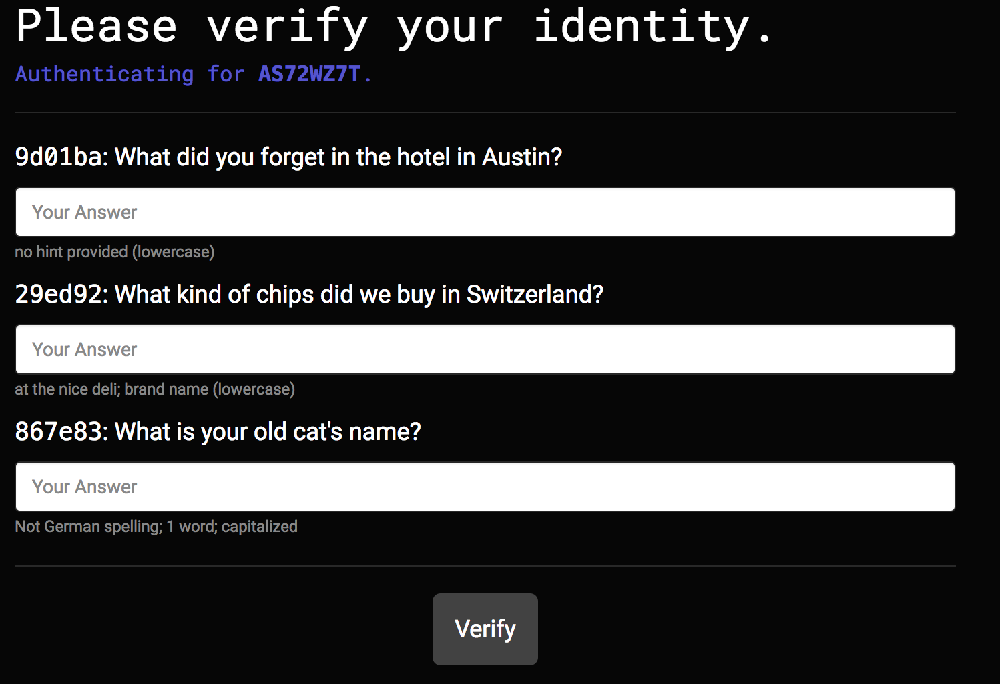
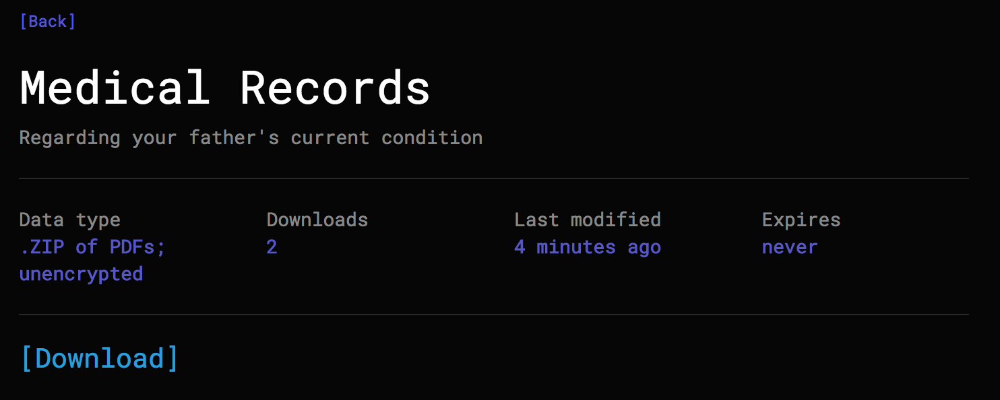

# Deaddrop
Secure, authenticated, and monitored file 'dead drops'

## Abbreviated features
* Hide files behind personal information, not passwords.
* Log downloads and login attempts.
* No Javascript required
* Time-based and download-based file expiration.
* Sender anonymity
* House-Of-Cards style(see LeAnn Harvey and Aidan MacAllen)
* 100% open source

## Potential use cases
* You want to make information available to one person, and one person only, but do not trust their email and want to ensure that only *they* are able to gain access to the files.
* You're unsatisfied with the level of logging that Dropbox or Google Drive provides.
* You want the files to expire after a single download.
* You want the files to expire after a certain period of time.
* ...or any combination of the above.

*Security questions aren't required, so it's possible to use Deaddrop as a super-monitored version of Dropbox or Google Drive.*

## Setting it up
Deaddrop is a pure Django app, and runs smoothly on both Python 2 and Python 3. Make sure to change the secret in `settings.py`, and be sure to turn `DEBUG` to `False`. Make sure that you use HTTPS to ensure that data is encrypted in transit.

## Caveats
* Data is not encrypted at rest (on roadmap to fix, in the meantime, encrypt your uploads in .ZIP files!)
* Answers to security questions are stored as plaintext (on roadmap to fix)
* There aren't extensive unit tests
* Still a beta-level product - **use with caution**

Apart from these concerns, however, Deaddrop was designed with security as its top priority. The session/authentication system has been seriously vetted. It is also worth noting that the two caveats are only problematic once the server and the filesystem itself is compromised.

If you have found a security vulnerability, please either create an issue or **contribute a fix!**

## Extended screenshots

**Secure access code entry page.**

**Identity verification page.**

**Identity verification page with incorrect response.**

**Drop index.**

**Example drop page.**

**Logged out message.**

**Incorrect/invalid secure access code.**

**Authenticated toolbar status.**

**Unauthenticated toolbar status.**
